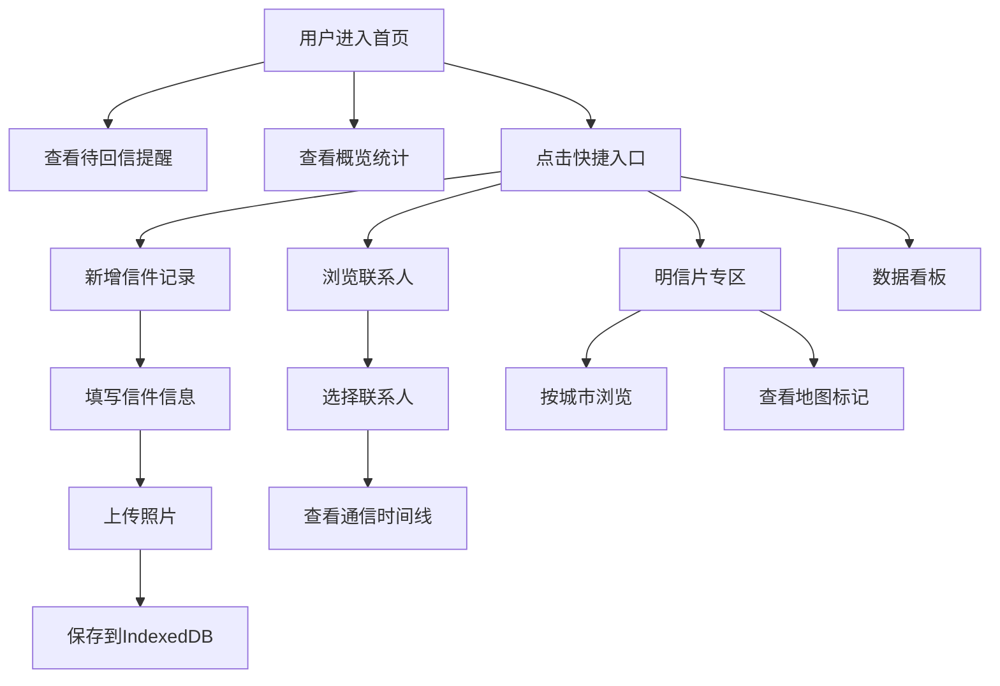

## 1. 产品概述

个人信件与明信片收发记录助手，帮助用户管理纸质信件与明信片的收发记录，留存每一份手写往来的珍贵记忆。通过数字化记录、智能分组与可视化分析，让传统书信的美好得以长久保存。

- 核心价值：为书信爱好者提供便捷的收发记录、智能提醒与数据统计
- 目标用户：笔友、明信片收藏爱好者、旅行爱好者

## 2. 核心功能

### 2.1 功能模块

1. **首页仪表盘**：待回信提醒列表、收发概览统计、快捷入口
2. **信件记录管理**：信件/明信片的增删改查，支持照片上传
3. **联系人时间线**：按联系人分组展示往来记录，通信时间线与统计
4. **明信片专区**：按城市/国家归类，地图标记收发地点
5. **数据看板**：年度统计、联系人排行、热力图、邮资统计

### 2.2 页面详情

| 页面名称 | 模块名称 | 功能描述 |
|---------|---------|-----------|
| 首页 | 待回信提醒 | 突出展示已收到但未回复的信件，显示等待天数 |
| 首页 | 概览卡片 | 年度收发总量、待回复数、明信片数量、总邮资 |
| 首页 | 最近记录 | 最近添加的5条信件/明信片记录 |
| 信件管理 | 列表视图 | 所有信件记录，支持筛选（类型/日期/联系人）与搜索 |
| 信件管理 | 新增/编辑表单 | 收发类型、联系人信息、日期、邮票、邮戳、照片上传 |
| 联系人 | 联系人列表 | 所有笔友卡片，显示往来总数与平均间隔 |
| 联系人 | 时间线详情 | 与某位笔友的完整通信时间线，往来统计 |
| 明信片专区 | 分类浏览 | 按城市/国家分组展示所有明信片 |
| 明信片专区 | 地图视图 | 地图标记收发地点，点击查看明信片详情 |
| 数据看板 | 年度统计 | 收发总量柱状图（按月份） |
| 数据看板 | 联系人排行 | 最常通信联系人TOP10排行榜 |
| 数据看板 | 热力月份 | 信件往来频次热力图分布 |
| 数据看板 | 邮资统计 | 寄出邮资总花费与趋势 |

## 3. 核心流程

## 4. 用户界面设计

### 4.1 设计风格

- **美学方向**：温暖怀旧 · 书信质感
- **主色调**：
  - 主色：温暖墨蓝 `#2C3E50`（墨水蓝）
  - 辅助色：羊皮纸米 `#F5EFE0`、信封红 `#C0392B`、邮票金 `#D4A017`
  - 中性色：深棕灰 `#4A4A4A`、浅米色 `#FBF7EF`
- **按钮风格**：圆角胶囊型，轻微阴影，悬浮时微微上浮
- **字体**：
  - 标题：Noto Serif SC（衬线体，书信感）
  - 正文：Noto Sans SC（清晰易读）
- **布局风格**：卡片式布局，羊皮纸质感背景，信封/邮票装饰元素
- **图标风格**：Lucide 线性图标，邮票边框装饰

### 4.2 页面设计概览

| 页面名称 | 模块名称 | UI 元素 |
|---------|---------|---------|
| 首页 | 待回信提醒 | 红色警示标签卡片，等待天数高亮显示，一键标记已回复 |
| 首页 | 概览卡片 | 四张统计卡片，图标+数字+趋势，羊皮纸质感 |
| 信件管理 | 列表卡片 | 信件卡片带邮票边框装饰，缩略图预览，悬停阴影 |
| 信件管理 | 表单 | 分段式表单，字段带图标前缀，照片上传拖拽区域 |
| 联系人 | 时间线 | 垂直时间线，左右交替展示收发，连接点用邮票图标 |
| 明信片 | 地图 | 浅色地图底图，彩色图钉标记，悬停显示明信片缩略图 |
| 数据看板 | 图表 | 淡色背景图表，墨蓝主线条，邮票金点缀 |

### 4.3 响应式

- 桌面优先（1280px+），响应式适配平板（768px）与移动端（375px）
- 桌面端：侧边栏导航 + 主内容区双栏布局
- 平板端：顶部折叠导航 + 单栏内容
- 移动端：底部Tab导航 + 垂直滚动内容
- 触摸优化：按钮最小高度44px，卡片点击反馈动画
