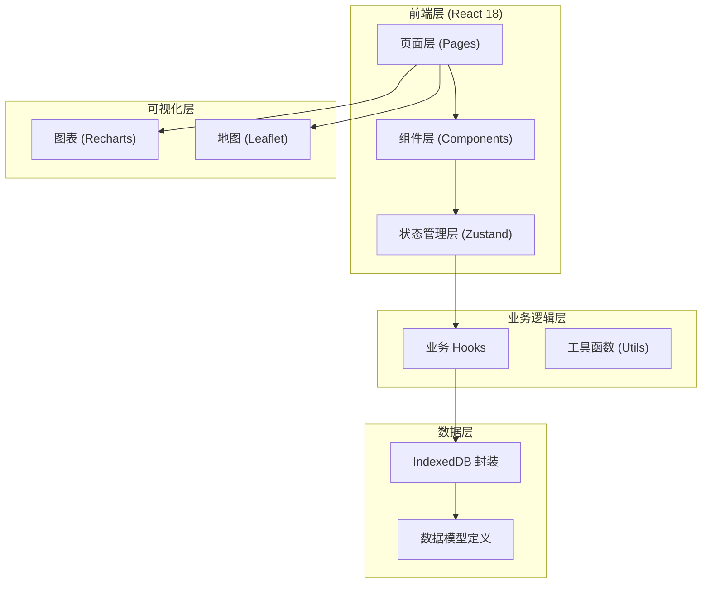
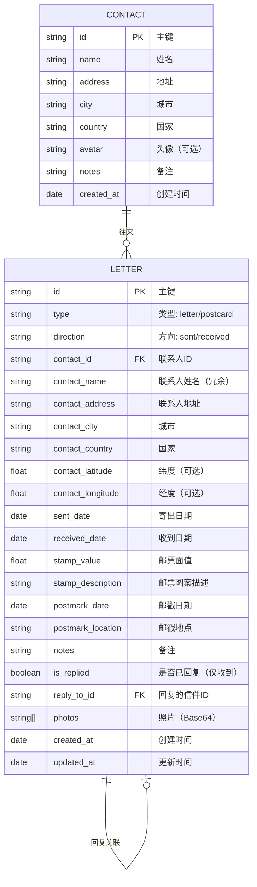

## 1. 架构设计



## 2. 技术描述

- **前端框架**：React@18 + TypeScript
- **构建工具**：Vite@5
- **样式方案**：TailwindCSS@3 + CSS 变量（主题系统）
- **状态管理**：Zustand
- **路由**：react-router-dom@6
- **数据库**：IndexedDB（idb 库封装）
- **图表库**：Recharts
- **地图库**：Leaflet + react-leaflet
- **图标库**：lucide-react
- **日期处理**：date-fns

## 3. 路由定义

| 路由 | 用途 |
|-----|-----|
| `/` | 首页仪表盘 - 待回信提醒、概览统计、最近记录 |
| `/letters` | 信件列表 - 所有信件记录，筛选搜索 |
| `/letters/new` | 新增信件 - 创建新信件/明信片记录 |
| `/letters/:id` | 信件详情 - 查看单条记录详情 |
| `/letters/:id/edit` | 编辑信件 - 修改现有记录 |
| `/contacts` | 联系人列表 - 所有笔友概览 |
| `/contacts/:id` | 联系人时间线 - 与某笔友的通信时间线 |
| `/postcards` | 明信片专区 - 分类浏览 + 地图 |
| `/dashboard` | 数据看板 - 统计图表与分析 |

## 4. 数据模型

### 4.1 实体关系图



### 4.2 IndexedDB Store 定义

```typescript
// database: letter_tracker

interface DBConfig {
  name: 'letter_tracker';
  version: 1;
  stores: {
    contacts: {
      keyPath: 'id';
      indexes: [
        { name: 'name', keyPath: 'name', unique: false },
        { name: 'city', keyPath: 'city', unique: false },
        { name: 'country', keyPath: 'country', unique: false },
        { name: 'created_at', keyPath: 'created_at', unique: false }
      ];
    };
    letters: {
      keyPath: 'id';
      indexes: [
        { name: 'contact_id', keyPath: 'contact_id', unique: false },
        { name: 'type', keyPath: 'type', unique: false },
        { name: 'direction', keyPath: 'direction', unique: false },
        { name: 'sent_date', keyPath: 'sent_date', unique: false },
        { name: 'received_date', keyPath: 'received_date', unique: false },
        { name: 'is_replied', keyPath: 'is_replied', unique: false },
        { name: 'contact_city', keyPath: 'contact_city', unique: false },
        { name: 'contact_country', keyPath: 'contact_country', unique: false },
        { name: 'created_at', keyPath: 'created_at', unique: false }
      ];
    };
  };
}
```
